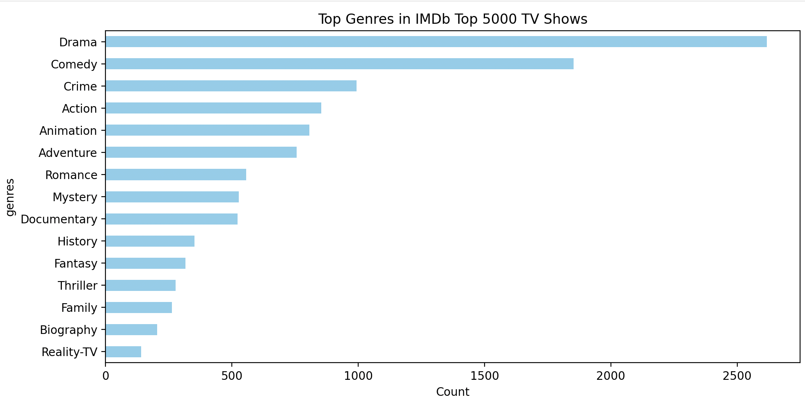
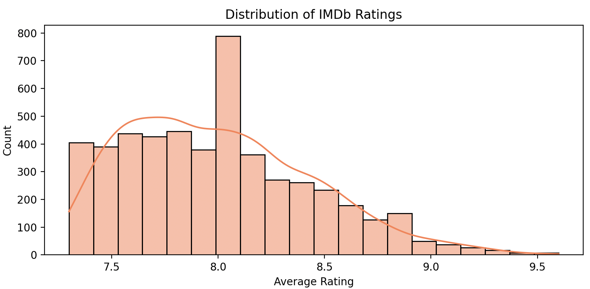
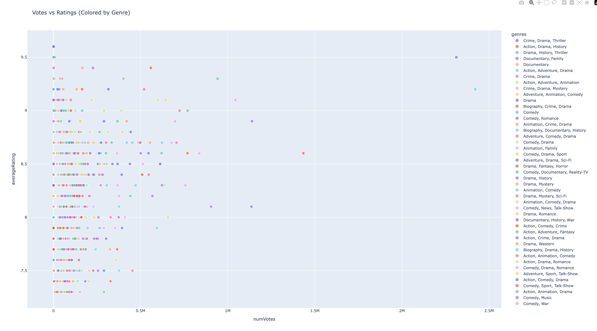

# 📺 IMDb Top 5000 TV Shows – EDA 

Welcome to a data-driven exploration of the **top 5000 TV shows** listed on IMDb. This project dives into ratings, genres, votes, and trends over time to uncover what makes a TV show stand out in the entertainment world.

---

##  Highlights

- 📊 **In-depth Exploratory Data Analysis (EDA)**
- 🎭 Genre trends, rating distributions, and vote analysis
- 📅 Trends in show releases and longevity
- 🌐 Interactive visualizations (via Plotly)
- 🔍 Ready to scale into a predictive or dashboard-based project

---

